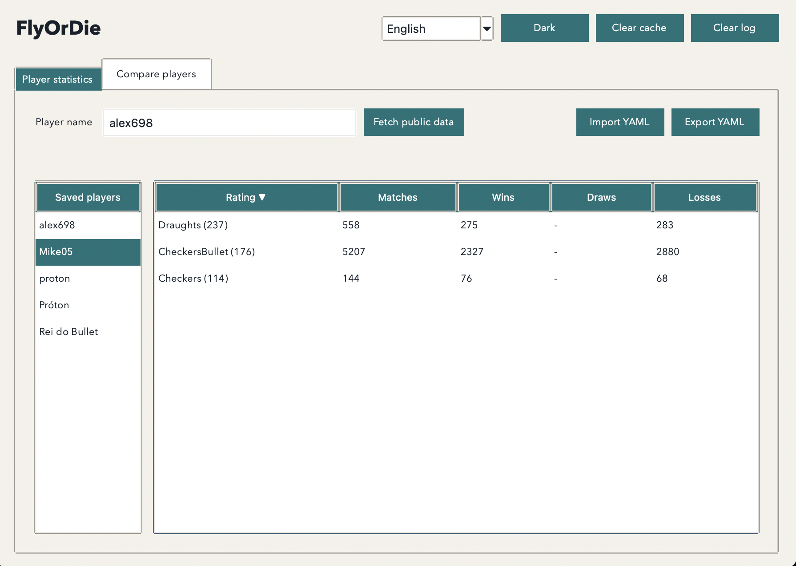
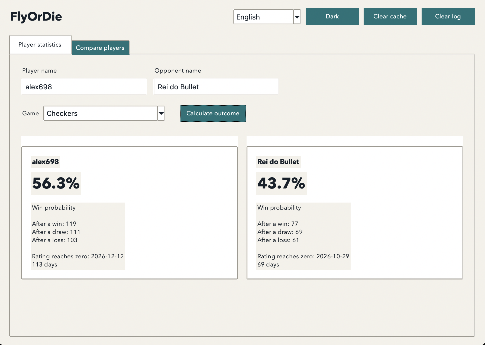

# FlyOrDie

FlyOrDie is a local desktop app for viewing public FlyOrDie player statistics and comparing two players with FlyOrDie's Elo-style rating model. It is not affiliated with FlyOrDie.




## What it does

- Retrieves public player and game statistics on demand.
- Lists previously saved players from `players/players.yaml` in a table beside the statistics, so switching between them needs no network.
- Sorts the statistics table by any column: the first click on a heading sorts descending, the next one ascending.
- Holds successful results in memory for ten minutes, avoiding duplicate requests during a session.
- Compares two saved players in a shared game and shows the expected win probability plus ratings after a win, draw, or loss of one single match.
- Suggests saved player names in the comparison fields — every saved name while a field is empty, filtered as you type — and loads both players on its own. Up/Down move through the list and Enter picks a name.
- Offers English (default) and Portuguese (Portugal), light/dark themes, YAML export and import, cache clearing, and log clearing.

## Quick start (uv)

From this project directory:

```bash
uv sync --extra dev
uv run flyordie
```

The app requires Python 3.10 or newer with Tkinter available. On macOS, the official Python installer from [python.org](https://www.python.org/downloads/macos/) normally includes Tkinter. You can check your active interpreter with:

```bash
uv run python -c "import tkinter; print('Tkinter is available')"
```

## Using the app

1. In **Player statistics**, enter a FlyOrDie player name and select **Load public data**.
2. Review each game’s rating and match record. Select **Export YAML** to export the merged player file.
3. In **Compare players**, pick two saved names. Choose a shared game, then select **Calculate outcome**. This tab never reaches FlyOrDie: it reads saved players only, and says so when a typed name is not saved yet.
4. Double-click a saved player to fetch it from FlyOrDie again. **Clear cache** forces the next lookup to use the network.

Player data is merged into `players/players.yaml` after every successful fetch. The file is created next to the directory where the app is started. **Clear log** truncates the rotating `flyordie.log` without stopping the application.

The comparison is an estimate, not a prediction of a real match. It calculates each player's expected Elo score with the correct rating direction: a higher-rated player is favoured, and the two probabilities add up to 100%. It always models one single match, so the rating change uses FlyOrDie's K value for a one-game series (16 in every rating band).

## Logging and troubleshooting

The app writes a rotating local log named `flyordie.log` to the directory where you start it. Each file is capped at 1 MB and the previous three files are retained. Logs contain operational events and error details; they do not include downloaded pages or exported player data.

If a profile cannot load:

- Check your connection and confirm the player has public FlyOrDie statistics.
- Try again later if FlyOrDie has changed or temporarily restricted its public pages.
- Read `flyordie.log` for the technical error, especially when reporting a problem.

## Project layout

```text
src/flyordie/
  app.py             # Tkinter UI and safe background-task handoff
  client.py          # Public FlyOrDie retrieval, parsing, and cache
  domain.py          # Data models and Elo/decay calculations
  storage.py         # Merged YAML player persistence
  logging_config.py  # Rotating local log configuration
  i18n.py            # English and pt-PT interface text
  paths.py           # Source-checkout vs packaged data locations
  __main__.py        # python -m flyordie / packaged entry point
tests/               # Calculation and legacy-markup parser tests
scripts/             # Icon generation and standalone app build
flyordie.spec        # PyInstaller build definition
```

## Building a standalone app

```bash
bash scripts/build.sh
```

The script generates the platform icons from `assets/favicon.ico`, then runs PyInstaller with `flyordie.spec`. On macOS it produces `dist/FlyOrDie.app` plus a `dist/FlyOrDie-<version>.dmg` you can drag into Applications; on Windows and Linux it produces a self-contained folder in `dist/FlyOrDie`. No Python installation is needed on the target machine.

The macOS build is ad-hoc signed and not notarised, so Gatekeeper blocks the first launch. Right-click the app and choose **Open**, or clear the quarantine flag:

```bash
xattr -dr com.apple.quarantine /Applications/FlyOrDie.app
```

A packaged build has no writable working directory, so it stores `players/players.yaml` and `flyordie.log` in the per-user data directory instead:

| Platform | Location |
| --- | --- |
| macOS | `~/Library/Application Support/FlyOrDie` |
| Windows | `%APPDATA%\FlyOrDie` |
| Linux | `$XDG_DATA_HOME/flyordie` (default `~/.local/share/flyordie`) |

Running from source is unchanged: both files still land next to the directory you start the app from.

The window icon comes from `assets/favicon.ico`, which is only 32x32, so the app and installer icons are upscaled. Drop in a 1024x1024 `favicon.ico` and rebuild for crisp Retina icons.

## Development checks

```bash
uv run pytest
uv run ruff check src tests
```
